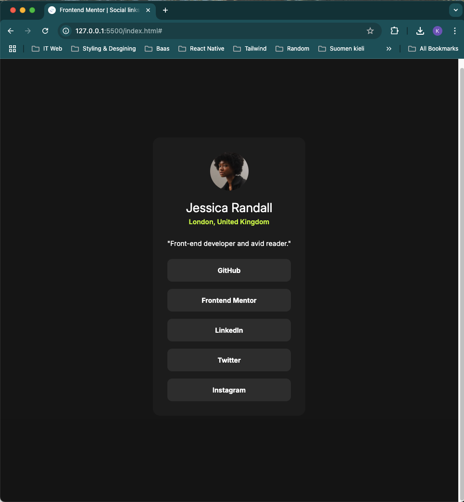

# Frontend Mentor - Social links profile solution

This is a solution to the [Social links profile challenge on Frontend Mentor](https://www.frontendmentor.io/challenges/social-links-profile-UG32l9m6dQ). Frontend Mentor challenges help you improve your coding skills by building realistic projects. 

## Table of contents

- [Overview](#overview)
  - [The challenge](#the-challenge)
  - [Screenshot](#screenshot)
  - [Links](#links)
- [My process](#my-process)
  - [Built with](#built-with)
  - [What I learned](#what-i-learned)
  - [Continued development](#continued-development)
  - [Useful resources](#useful-resources)
- [Author](#author)
- [Acknowledgments](#acknowledgments)


## Overview

This project is to rehearse knowledge in using HTML and CSS.

### The challenge

Users should be able to:

- See hover and focus states for all interactive elements on the page

### Screenshot




### Links

- Solution URL: [Click here](https://github.com/niophan/social-links-profile-fe_3)
- Live Site URL: [Click here](https://your-live-site-url.com)

## My process

### Built with

- Semantic HTML5 markup
- CSS custom properties
- Flexbox
- Mobile-first workflow


### What I learned

While working through this project i recap of how to use internal CSS and make custom cursor


### Continued development

I tried to make a custom cursor to match the cursor's color in the design, but then i figured out that custom cursors is inconsistent across browsers. Below syntax helps to customer the cursor with a picture, but then again need to figure out the default cursor size to match with the original cursor.
```css
.cursor { cursor: url(images/my-cursor-design.png), auto; }
```

### Useful resources

- [cursor](https://developer.mozilla.org/en-US/docs/Web/CSS/cursor)

## Author

- Frontend Mentor - [@niophan](https://www.frontendmentor.io/profile/niophan)
- Github - [@niophan](https://github.com/niophan)


## Acknowledgments

Thanks Frontend Mentor for this challenge.
